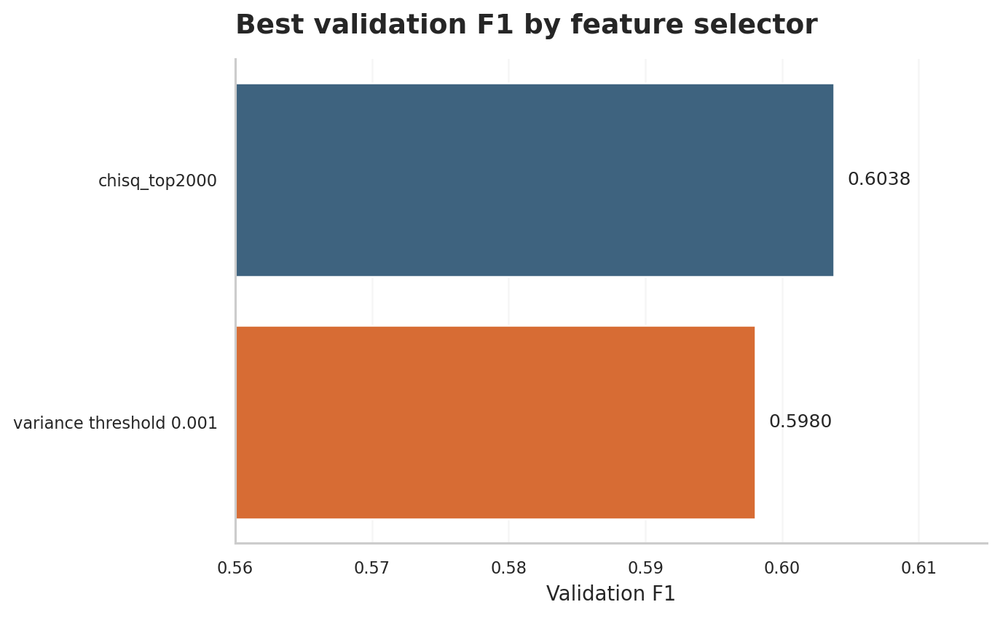
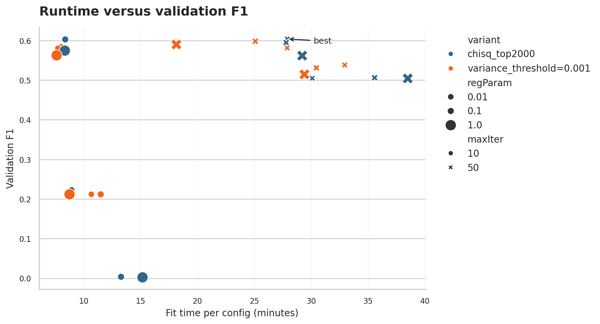

# Assignment 2 Part 3 Output Analysis

Source files: `data/output_part3.json` and `data/output_part3_full_best.json`.

## Figures

## Headline Results

- Best dev-set grid config: `chisq_top2000`, `regParam=0.01`, `standardization=True`, `maxIter=50`.
- Best validation F1: **0.6038**.
- Held-out dev-set test F1: **0.6041**.
- Full-dataset best-config test F1: **0.5674** after **4.55 h** fitting and **3.4 min** evaluation.

## Selector Comparison

| selector variant | best val F1 | mean val F1 | mean fit time |
|---|---:|---:|---:|
| `chisq_top2000` | 0.6038 | 0.4404 | 21.0 min |
| `variance_threshold=0.001` | 0.5980 | 0.4762 | 18.2 min |

`chisq_top2000` is the best primary selector. The variance-threshold alternative remains close in its best standardized rows, but it is weaker on average because it is label-blind.

## Hyperparameter Effects

| group | setting | best val F1 | mean val F1 | mean fit time |
|---|---|---:|---:|---:|
| standardization | `False` | 0.5381 | 0.3302 | 22.1 min |
| standardization | `True` | 0.6038 | 0.5863 | 17.0 min |
| maxIter | `10` | 0.6032 | 0.3642 | 9.7 min |
| maxIter | `50` | 0.6038 | 0.5523 | 29.4 min |
| regParam | `0.01` | 0.6038 | 0.4808 | 19.3 min |
| regParam | `0.1` | 0.6027 | 0.4539 | 20.0 min |
| regParam | `1.0` | 0.5898 | 0.4401 | 19.4 min |

Main conclusions:

- `standardization=True` is the dominant quality switch. Without it, several `maxIter=10` runs barely learn at all.
- `maxIter=50` gives the best final row, but the corresponding `maxIter=10` row is very close. The extra iterations are expensive, so this is a quality/runtime trade-off.
- `regParam=0.01` is best for `chisq_top2000`; stronger regularization underfits the 2000-dimensional label-aware feature set.
- The full-dataset run is exploratory: it uses the best dev-set config but evaluates on a much larger and apparently harder split, giving lower F1.

## Top 10 Configs

| rank | variant | regParam | std | maxIter | val F1 | fit time |
|---:|---|---:|:---:|---:|---:|---:|
| 1 | `chisq_top2000` | 0.01 | True | 50 | 0.6038 | 27.9 min |
| 2 | `chisq_top2000` | 0.01 | True | 10 | 0.6032 | 8.4 min |
| 3 | `chisq_top2000` | 0.1 | True | 10 | 0.6027 | 8.4 min |
| 4 | `variance_threshold=0.001` | 0.1 | True | 50 | 0.5980 | 25.1 min |
| 5 | `chisq_top2000` | 0.1 | True | 50 | 0.5947 | 27.8 min |
| 6 | `variance_threshold=0.001` | 1.0 | True | 50 | 0.5898 | 18.1 min |
| 7 | `variance_threshold=0.001` | 0.1 | True | 10 | 0.5832 | 8.0 min |
| 8 | `variance_threshold=0.001` | 0.01 | True | 50 | 0.5812 | 27.9 min |
| 9 | `variance_threshold=0.001` | 0.01 | True | 10 | 0.5802 | 7.7 min |
| 10 | `chisq_top2000` | 1.0 | True | 10 | 0.5744 | 8.3 min |
