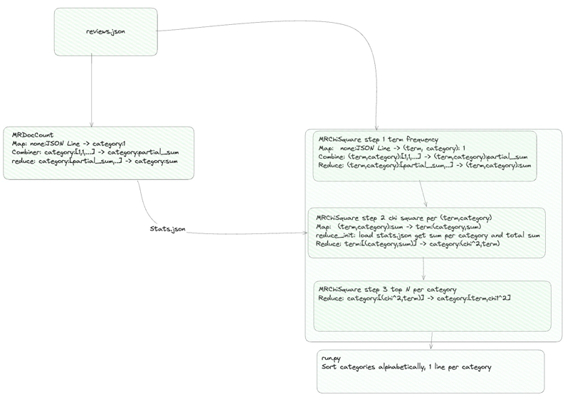

# Assignment 1 -- Chi-square Term Selection on the Amazon Reviews Corpus

---

## 1. Introduction


This assignment builds a vocabulary from the Amazon Reviews 2014
dataset (22 categories, 142.8 M reviews, 56 GB) by
computing **chi-square** statistics for every `(term, category)`
pair and keeping the 75 highest-scoring terms per category. The work is
expressed entirely as Hadoop MapReduce jobs written in Python on top of
`mrjob`, and runs on the TUWien LBD cluster (as well as locally with the test dataset if needed).
For the local setup uv was used to provide fast usage and reproducability.

Deliverables: 
* `output.txt` — the top-75 discriminative terms per category, followed
  by the merged alphabetical dictionary.
* A report 
* A `src/` directory with the fully documented MapReduce implementation
  and a single `src/run_assignment1.sh` driver.

## 2. Problem Overview

### 2.1 Input

A single NDJSON file on HDFS (`reviews_devset.json` for development,
`reviewscombined.json` for the final run). Each line is a review with at
least the fields `reviewText` (string) and `category` (string). All other
fields are ignored.

### 2.2 Preprocessing requirements

Tokens are extracted per review by:

1. **Tokenization** — splitting on whitespace, digits, and the character
   class `()[]{}.!?,;:+=-_"'` `~#@&*%€$§\/`, implemented as a single
   compiled `re` pattern (`DELIMITER_PATTERN` in `chi_square.py`).
2. **Case folding** — via `str.casefold()` applied to the review text
   before splitting.
3. **Stopword filtering** — the provided `stopwords.txt` is loaded once
   per mapper into a Python `set`; tokens present in the set are
   dropped. Tokens of length ≤ 1 are also dropped.

This was its own class in a first step but since it is only needed in *chi_sqare.py* was inlined. 

### 2.3 Target metric

For a term `t` and a category `c` we build the 2×2 contingency table

|                       | contains `t`              | does **not** contain `t`         |
| --------------------- | ------------------------- | -------------------------------- |
| **in `c`**            | `A = N_tc`                | `C = N_c - N_tc`                 |
| **not in `c`**        | `B = N_t - N_tc`          | `D = N - N_c - N_t + N_tc`       |

where

* `N` = total number of reviews,
* `N_c` = reviews in category `c`,
* `N_t` = reviews containing term `t`,
* `N_tc` = reviews in `c` containing `t`.

The chi-square statistic is

```
           N · (A·D - B·C)²
chi^2 (t, c) = ─────────────────────────────────
           N_t · (N - N_t) · N_c · (N - N_c)
```

### 2.4 Required outputs

One line per category (alphabetical) with the top 75 terms in the form
`<category> term_1:chi^2_1 term_2:chi^2_2 ...`, followed by a line holding
the alphabetically sorted union of all selected terms.
The final sorting and building happens in the run.py

### 2.5 Challenges

The work is parallel at the mapper side (tokenization is
per-review) but requires three joins that force shuffles:

* `N_tc` ← group by `(term, category)`,
* `N_t` and chi^2 ← group by `term` (needs all categories the term appears
  in),
* top-75 + merge ← group by `category` (needs all `(chi^2, term)` pairs for
  that category).

The efficiency bottleneck should be shuffle volume at each
stage (use of combiners, document-level instead of token-level
counting, bounded-memory top-N) and keeping the global aggregates `N`
and `N_c` out of the main shuffle path (broadcast as a tiny side
input).

## 3. Methodology and Approach

### 3.1 Pipeline overview

The solution is split into **two `mrjob` MapReduce jobs** orchestrated
by `run.py`:

1. **`MRDocCounts`** — one step, produces a tiny JSON file
   `{<category>: N_c, ...}`. `N` is derived downstream as
   `sum(N_c.values())` — every review belongs to exactly one category,
   so carrying a separate global counter would be redundant.
2. **`MRChiSquare`** — three steps consuming the corpus once, with the stats JSON uploaded as side
   input via `--file` so every reducer in step 2 has access to `N_c`
   without an extra shuffle.

The driver  writes `output.txt` and merges the global dictionary
line. No data other than the `output.txt` ever leaves HDFS.

### 3.2 Data-flow and `<key, value>` design

In the given picture one can see our high level setup of MRJobs as well as their respective inputs and outputs for the different steps. 
It starts of with job 1 which builds a sum of entries per category. 
This should reduce shuffling and data movement in downstream jobs and is thus supplied to the other MR job as a json file. 
The ChiSquare calculation is done in 3 steps where in 
- 1 we build sums for (term,category) pairs.
- 2 calculate chi^2 per (term,category)
- 3 get top N per category

### 3.3 Per-step details

**Job 1 — `MRDocCounts`.** A single MR step that emits `(category, 1)`
for every review, combines and reduces by summing. The output is 22
lines. It exists solely to avoid recomputing `N_c` inside every step-2
reducer or scanning the corpus twice in Job 2.

**Job 2, Step 1 — `(term, category)` document frequency.**

* `mapper_init_s1` loads `stopwords.txt` once per task into a `set`.
* `mapper_s1` parses the JSON line, tokenizes and deduplicates then emits `((term, category), 1)`
  regardless of how often the term appears in that review. This gives
  **document frequency**.
* `combiner_s1` and `reducer_s1` sum the `1`s. The combiner collapses `1`s into a single partial sum inside each map task, which should save a lot of shuffle work. 

**Job 2, Step 2 — chi^2 per term.**

* `mapper_s2` re-keys the step-1 output from `(term, category) → N_tc`
  to `term → (category, N_tc)`, so that every reducer invocation sees
  the full distribution of a term over categories.
* `reducer_init_s2` reads `stats.json` once into memory and derives
  `N = sum(N_c.values())`.
* `reducer_s2` computes `N_t` as the sum of `N_tc` over the
  incoming pairs, then emits `(category, (xhi^2, term))`
  for each category the term appears in. 
* 
**Job 2, Step 3 — top-75 per category.**

* `reducer_s3` uses `heapq.nlargest(75, values)` to keep only the best
  75 `(chi^2, term)` pairs per category in `O(75)` memory, independent of
  how many distinct terms appear in that category. The reducer output
  is already sorted in chi^2 descending order.

**Post-processing.** `run.py` collects the step-3 output, sorts
categories alphabetically, formats each line as the assignment
requires, and appends the merged dictionary line.

### 3.4 Partitioning, sorting, combining

* **Partitioning** uses `mrjob`'s default hash partitioner on the
  JSON-serialised key. Step 1 partitions on `(term, category)` tuples,
  step 2 on `term`, step 3 on `category`. No custom partitioner was used or tried since performance seemed adequate.
* **Sorting** is the default lexical ordering of the serialized keys.
  The reducers never rely order, so no secondary sort is required.
* **Combiners** are enabled in Job 1 (sum per category) and Step 1 of
  Job 2 (sum per `(term, category)`). Both are plain commutative which is why we can use them. 
  Step 2 and step 3 have no combiner because their reducers are not
  associative over partial lists.
* **Reducer counts** are tuned per step and exposed via CLI flags
  (`--reducers-s1/s2/s3`, defaults 60/60/22). 60 was taken as a guess and no further tuning was done since performance semed adequate.
    22 is the number of categories. 
* 

### 3.6 Running the pipeline

A single driver script covers both local and cluster execution:

```bash
# Local dev (inline runner, devset)
./src/run_assignment1.sh data/reviews_devset.json

# Cluster (devset)
RUNNER=hadoop ./src/run_assignment1.sh \
    hdfs:///dic_shared/amazon-reviews/full/reviews_devset.json

# Cluster (full 56 GB set — only after a clean devset run)
RUNNER=hadoop ./src/run_assignment1.sh \
    hdfs:///dic_shared/amazon-reviews/full/reviewscombined.json
```

All paths are relative; the HDFS input path is the only positional
argument. Reducer counts can be overridden via env vars
(`REDUCERS_S1`, `REDUCERS_S2`, `REDUCERS_S3`).

The driver resolves its own directory so it works regardless of the
caller's `cwd`, prefers `uv run python` when available (and otherwise
falls back to `python3` with `PYTHONPATH` pointing at `src/` for the
cluster), and only injects `--hadoop-streaming-jar` when
`RUNNER=hadoop` (overridable via `HADOOP_STREAMING_JAR`). This keeps a
single entry point for both local and cluster execution without
duplicating wiring in `run.py`.

## 4. Conclusions

The pipeline separates the two classes of aggregation the
problem demands: a small global aggregation (`N_c`) broadcast as a side
input, and a heavy, term-partitioned aggregation (`N_tc`, chi^2, top-N)
driven as a three-step MRJob. This keeps the corpus read to exactly two
full passes (once for Job 1, once for Job 2) and keeps the most expensive shuffle 
step 1 of Job 2 in the smallest possible form because of the document-level `set()`
deduplication and the per-task combiner.
