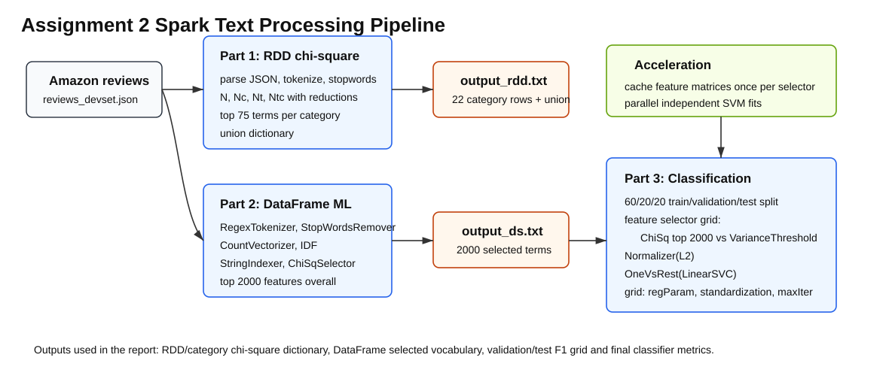
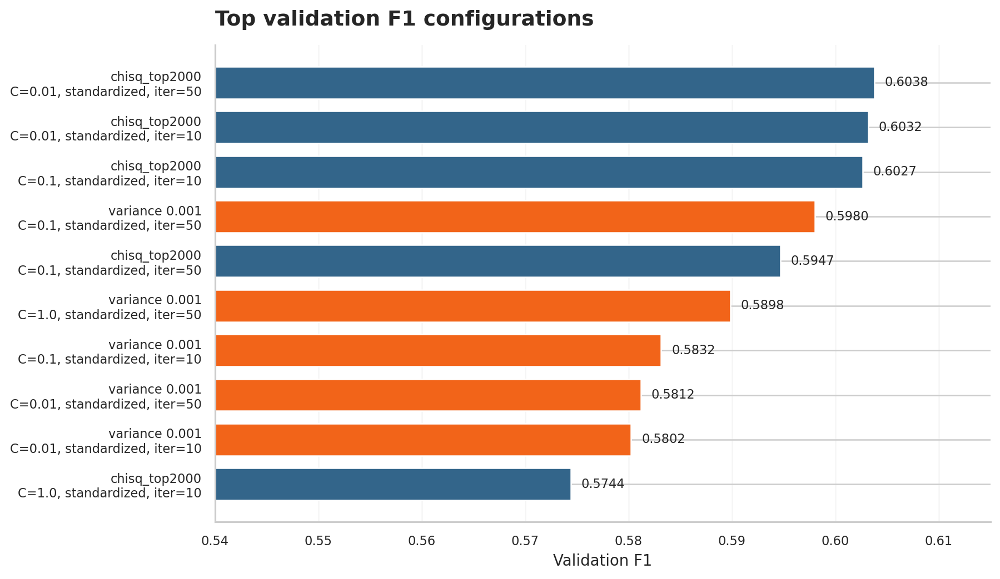
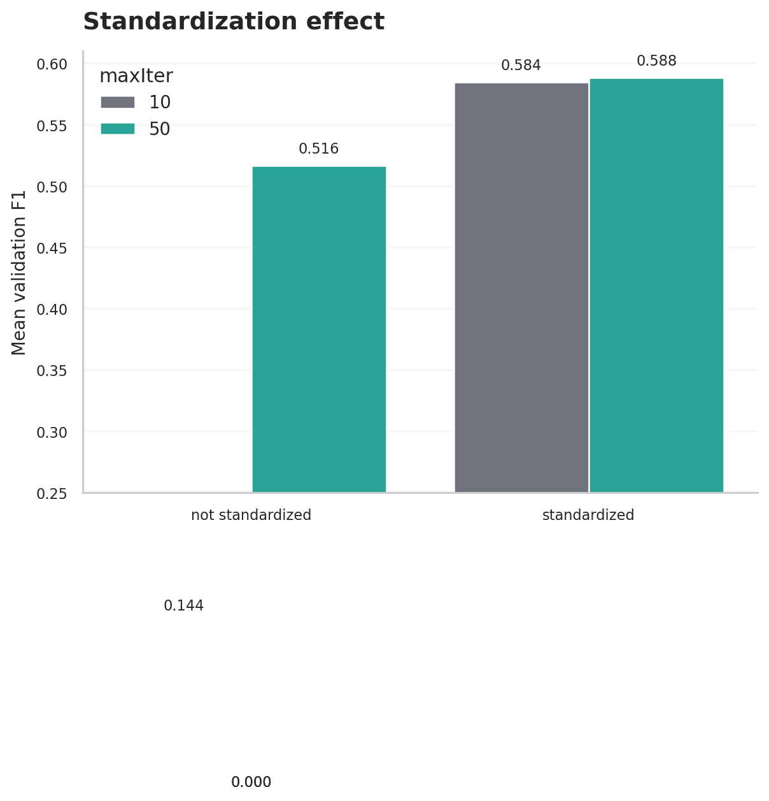
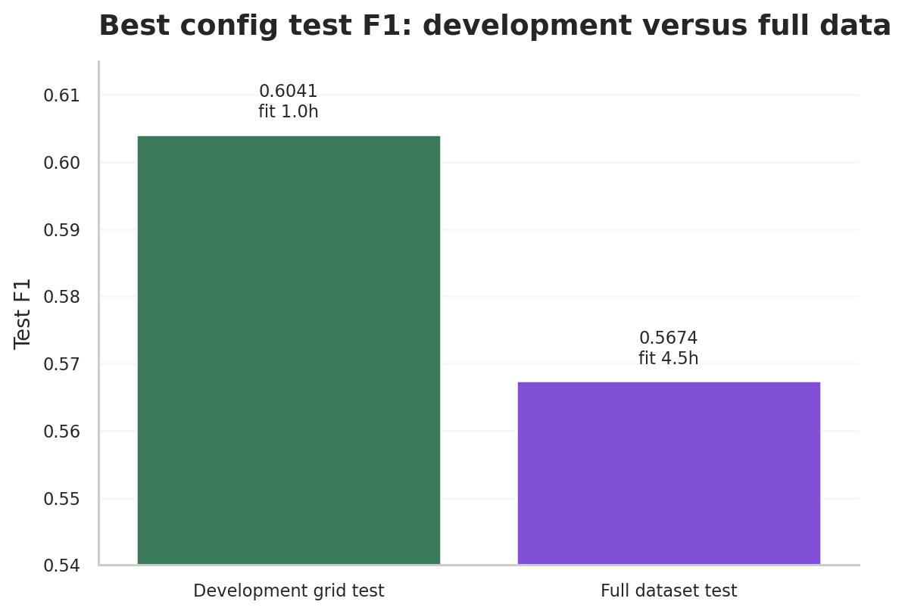

# Assignment 2: Text Processing and Classification using Apache Spark

Contributing members: Martin Weber, Hussain Muhammad Bilal, Ayegwalo-Ogbogbo Clara Ochuwa, Gurrala Shreya, 	Maggetto Andrea

## 1. Introduction

This assignment reimplements the Amazon Reviews text-processing workflow from Assignment 1 with Apache Spark and extends it into a supervised text-classification experiment. All required outputs were produced on the development set `reviews_devset.json`, which contains 78,829 reviews across 22 product categories. The submitted artefacts are `output_rdd.txt` for the RDD chi-square dictionary, `output_ds.txt` for the Spark ML selected TF-IDF vocabulary, and the notebooks/scripts in `src/data_intensive_computing/assignment2/`.

The main design goal was to keep the implementations close to Spark's execution model: Part 1 uses RDD transformations and reductions for the same document-frequency chi-square statistic as Assignment 1  
Part 2 uses a Spark ML pipeline for tokenisation, TF-IDF, and feature selection 
Part 3 reuses that representation for a reproducible train/validation/test SVM experiment. 

## 2. Problem Overview

The input consists of JSON reviews. Each record contributes the `reviewText` and `category` fields. Malformed records or rows without a category are ignored. Tokenisation follows the assignment delimiter set: whitespace, tabs, digits, and `()[]{}.!?,;:+=-_"'\`~#@&*%€$§\/`. Tokens are lower-cased/case-folded, filtered with the provided stopword list, and restricted to length at least two.

Part 1 computes the Assignment 1 chi-square document-presence statistic for every `(term, category)` pair and writes the top 75 terms per category plus the sorted union dictionary. Part 2 builds a classic vector-space representation using Spark ML and writes the 2000 terms selected by `ChiSqSelector`. Part 3 trains a category classifier from the Part 2 feature pipeline, using a one-vs-rest strategy with binary linear SVMs since this was the limitation given and multiple classes need to be prediced.
F1 is used as the evaluation metric.

The three parts intentionally do not select identical vocabularies as stated in the exercise definition. Part 1 ranks binary term presence per category, while Part 2 selects a single global top-2000 feature set over TF-IDF-valued vectors. This changes both the representation and the selection scope.

## 3. Methodology and Approach

### Part 1: RDD chi-square

The RDD notebook parses each review into `(category, token_set)` records and caches that RDD because it is reused for category counts and term/category counts. `N_c` and total `N` are computed with `reduceByKey` and collected as a small driver-side dictionary, then broadcast for the chi-square calculation.

For the heavy term statistics, the implementation emits `((term, category), 1)` once per review, not once per token occurrence. This preserves document frequency and avoids counting repeated words inside the same review. `reduceByKey` produces `N_tc`; records are then re-keyed by term so that `N_t = sum_c N_tc` can be computed in one place. The reducer emits `(category, (chi2, term))`, and a bounded heap keeps only the top 75 entries per category. The final output formatting sorts categories alphabetically and appends the joined dictionary.

### Part 2: DataFrame/Spark ML vocabulary selection

The DataFrame pipeline is:

`RegexTokenizer -> StopWordsRemover -> CountVectorizer -> IDF -> StringIndexer -> ChiSqSelector(numTopFeatures=2000)`

`RegexTokenizer` uses the assignment delimiter regex with `gaps=True`, and `StopWordsRemover` uses the provided stopword file. `CountVectorizer` learns the vocabulary from the corpus, `IDF` produces TF-IDF features, `StringIndexer` maps category labels to numeric labels, and `ChiSqSelector` selects 2000 feature indices overall. The selected indices are mapped back through the learned `CountVectorizer` vocabulary and written alphabetically to `output_ds.txt`.

### Part 3: classification experiment

The classification pipeline extends Part 2 with `Normalizer(p=2.0)` and `OneVsRest(LinearSVC)`. The split is reproducible with seed `11817173`.

The grid search compares the required `ChiSqSelector(numTopFeatures=2000)` representation with a heavier, lower-dimensional `VarianceThresholdSelector(varianceThreshold=0.001)` alternative. For each selector, the SVM grid varies:

| parameter | values |
|---|---|
| `regParam` | `0.01`, `0.1`, `1.0` |
| `standardization` | `True`, `False` |
| `maxIter` | `10`, `50` |

This yields 24 configurations. To reduce overhead, the implementation fits and caches the preprocessing/feature stages once per selector variant, materialises only `label, features`, and then fits independent one-vs-rest SVM models for the classifier grid. This avoids repeatedly fitting `CountVectorizer`, `IDF`, `StringIndexer`, and the selector for every SVM configuration.

## 4. Results

### Part 1 output comparison

`output_rdd.txt` contains 22 category rows and a final joined dictionary with 1,464 unique terms. The RDD output has the same structure as the Assignment 1 output: category-specific top terms followed by the alphabetical union.

The `output.txt` of exercise 1 is not byte-identical to `output_rdd.txt`, and its chi-square values are now much larger, because exercise 2 was only executed on the devset while exercise 1 was run on the whole dataset. 

### Part 2 vocabulary comparison

| set | size |
|---|---:|
| Part 2 `output_ds.txt` | 2,000 |
| Part 1 joined dictionary | 1,464 |
| Intersection | 751 |
| Part 2 only | 1,249 |
| Part 1 only | 713 |

The overlap is about 51% of the Part 1 dictionary. This is expected because Part 1 uses binary document-presence chi-square and keeps the top 75 terms per category, while Part 2 applies `ChiSqSelector` globally to TF-IDF features. Strong per-category terms such as `crib`, `acne`, `dewalt`, `medela`, and `aquarium` appear in Part 1 but not in `output_ds.txt`. Conversely, Part 2 includes more generic words such as `access`, `account`, `adult`, `advice`, `amazing`, and `american`, which have TF-IDF value distributions that Spark's global selector keeps even though they are not among any category's top 75 binary-presence terms.

### Part 3 classification results

The best development-set validation result is obtained by the label-aware chi-square selector:

| selector variant | best parameters | validation F1 | test F1 |
|---|---|---:|---:|
| `chisq_top2000` | `regParam=0.01`, `standardization=True`, `maxIter=50` | 0.6038 | 0.6041 |
| `variance_threshold=0.001` | `regParam=0.1`, `standardization=True`, `maxIter=50` | 0.5980 | not selected |

Top validation configurations:

| rank | variant | `regParam` | `standardization` | `maxIter` | validation F1 |
|---:|---|---:|:---:|---:|---:|
| 1 | `chisq_top2000` | 0.01 | True | 50 | 0.6038 |
| 2 | `chisq_top2000` | 0.01 | True | 10 | 0.6032 |
| 3 | `chisq_top2000` | 0.1 | True | 10 | 0.6027 |
| 4 | `variance_threshold=0.001` | 0.1 | True | 50 | 0.5980 |
| 5 | `chisq_top2000` | 0.1 | True | 50 | 0.5947 |

The strongest effect is `standardization=True`. With that enabled, the mean validation F1 is 0.5863; without it, the mean drops to 0.3302. `maxIter=50` gives the highest single score, but the best `maxIter=10` model is only 0.0006 F1 lower and trains much faster (about 2x+ speedup on the cluster on a per config time basis). `regParam=0.01` is best for the chi-square top-2000 representation, while the variance-threshold representation prefers `regParam=0.1`.

### Full-dataset best-run finding

As an additional non-required experiment, the single best development-set configuration was also run once on the full `reviewscombined.json` corpus. This was not a full grid search on the whole dataset. We just reused the selected model shape, `ChiSqSelector(numTopFeatures=2000)` with `LinearSVC(regParam=0.01, standardization=True, maxIter=50)`.

| input | total reviews | train+validation | test | test F1 | fit time | eval time |
|---|---:|---:|---:|---:|---:|---:|
| full `reviewscombined.json` | 78,828,876 | 63,066,555 | 15,762,321 | 0.5674 | about 4h | 3.4 min |

The full-data run confirms that the chosen development-set configuration scales to the mandatory large corpus, but the F1 drops from 0.6041 on the development-set test split to 0.5674 on the full-data test split.

## 5. Conclusions

The RDD implementation reproduces the Assignment 1 style of binary document-frequency chi-square selection in Spark while keeping shuffle volume controlled through per-review token deduplication and reduction by `(term, category)`. The DataFrame pipeline follows the requested Spark ML design and produces a different but explainable vocabulary because TF-IDF-valued global chi-square selection is not equivalent to per-category binary chi-square.

For classification, the best model is `ChiSqSelector(numTopFeatures=2000)` followed by L2 normalisation and `OneVsRest(LinearSVC)` with `regParam=0.01`, `standardization=True`, and `maxIter=50`. It reaches 0.6038 validation F1 and 0.6041 held-out test F1 on the development set. The variance-threshold alternative is close but slightly weaker, so the label-aware chi-square feature selection remains the preferred choice. The experiments also show that SVM standardisation matters more than the exact selector choice in this setup.
